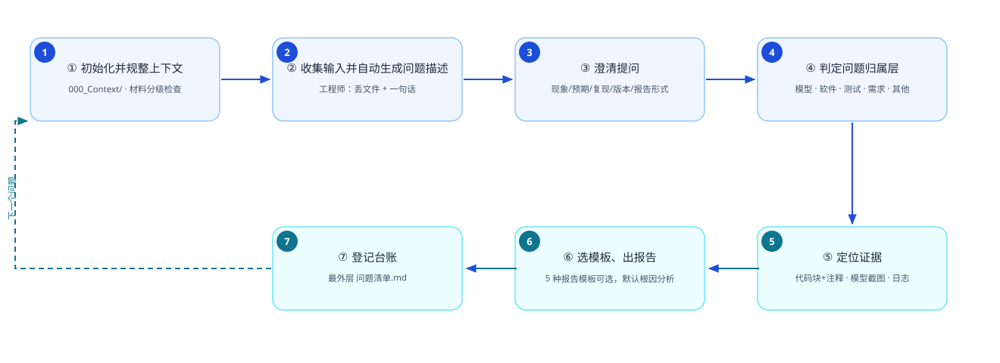
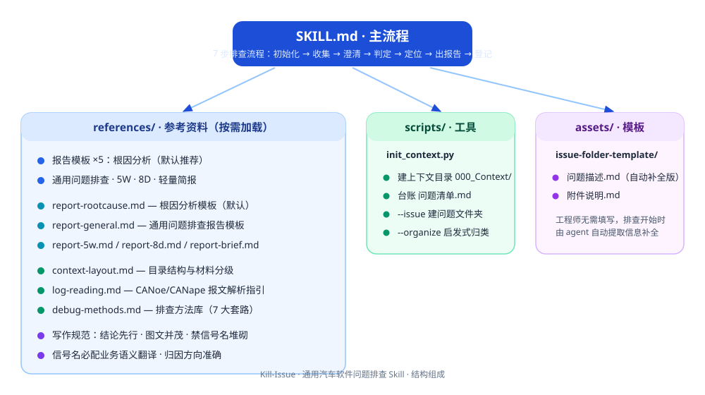

<div align="center">

# 🎯 Kill-Issue · 汽车软件问题排查 Skill

**把"汽车控制器软件问题排查"固化为标准流程 —— 读上下文 → 澄清问题 → 判定归属层 → 定位证据 → 输出规范化报告 → 登记台账**

[](../../releases)
[](../../stargazers)
[](../../)
[](../../commits)
[](./skill/Kill-Issue)
[](./README.md#许可)

---

**技术栈 / 能力标签**


**通用方法论 · 适用于任何 Simulink 控制模型 / 生成代码项目**

</div>

---

## 📑 目录

- [特性](#-特性)
- [工作流](#-工作流)
- [结构组成](#-结构组成)
- [目录结构](#-目录结构)
- [安装](#-安装)
- [快速开始](#-快速开始)
- [上下文材料分级](#-上下文材料分级)
- [报告模板](#-报告模板)
- [报告写作规范](#-报告写作规范)
- [项目目录约定](#-项目目录约定)
- [版本与发布](#-版本与发布)
- [许可](#-许可)

---

## ✨ 特性

- **通用**：不限于任何控制器、功能类型或问题类型（状态/显示、控制逻辑、标定、通信报文、测试异常等）
- **五层归因**：模型 / 软件 / 测试 / 需求 / 其他
- **5 种报告模板**：根因分析（默认）、通用问题排查、5W、8D、轻量简报
- **工程师零负担**：只丢文件（logs / CANoe·CANape 报文 / 截图 / trace）+ 一句话描述，信息由 agent 自动补全
- **上下文分级**：模型+代码必须，DBC 条件必需，其余按需——不要求 7 类材料给全
- **结构化目录**：`000_Context/` 通用上下文 + `001/002/003-问题` 串行编号 + 最外层台账

---

## 🔄 工作流



---

## 🧩 结构组成



---

## 📂 目录结构

```
Kill-Issue/
├── SKILL.md                          主流程（7 步排查）
├── scripts/init_context.py           初始化：建上下文目录/台账/问题文件夹/文件归类
├── references/
│   ├── report-rootcause.md           根因分析报告模板（默认推荐）
│   ├── report-general.md             通用问题排查报告模板（正式完整交付）
│   ├── report-5w.md                  5W 分析模板
│   ├── report-8d.md                  8D 报告模板
│   ├── report-brief.md               轻量定位简报模板
│   ├── context-layout.md             目录结构与上下文材料分级清单
│   ├── log-reading.md                CANoe/CANape 日志解析指引
│   └── debug-methods.md              排查方法库（7 大套路 + 常见坑）
└── assets/issue-folder-template/     问题描述（自动补全版）与附件说明模板
```

---

## 📥 安装

### Reasonix（推荐）

解压 `dist/Kill-Issue.skill`，把 `Kill-Issue/` 文件夹放到：

- 项目级：项目根 `.reasonix/skills/`
- 全局：Reasonix home 的 skills 目录

### Claude Code / Anthropic 生态

把 `Kill-Issue/` 文件夹放到 `~/.claude/skills/`（个人）或项目 `.claude/skills/`（项目级）。若工具校验要求全小写，文件夹改名 `kill-issue` 即可（仅安装适配，正式名为 Kill-Issue）。

---

## 🚀 快速开始

```bash
# 1. 初始化：建通用上下文目录 + 台账 + 问题文件夹
python scripts/init_context.py <项目根> --issue "001-问题精确描述"

# 2. 可选：对散放文件做启发式归类（*.slx→模型、*.c→代码、接口表→接口、*.sldd→标定、报文→日志）
python scripts/init_context.py <项目根> --organize <散放目录>
```

工程师只需两步，其余交给 agent：

1. 把问题文件丢进 `附件/` 或拖入对话：logs、CANoe/CANape 报文（.asc/.blf/.mf4/.dat）、截图、trace
2. 输入框一句话描述："XX 模式下某执行器开度很小调不了"

---

## 📋 上下文材料分级（不需要 7 类给全）

| 级别 | 材料 | 说明 |
|---|---|---|
| **必须** | 模型（01_Model）、生成代码（02_Code） | 缺了 agent 会提醒补齐 |
| **条件必需** | DBC / 接口表（04_Interface） | 问题附件含 log/报文时必给 DBC，否则报文解析不成信号 |
| **按需** | 需求（03）、标定（05）、测试说明（06）、共享日志（07） | 按问题类型需要时再提供，缺失不阻塞 |

---

## 📝 报告模板（用户可选）

| 报告形式 | 适用场景 | 产物文件名 |
|---|---|---|
| **根因分析报告（默认）** | 控制逻辑、状态/模式、显示、通信类问题完整技术排查 | 根因分析报告.md |
| **通用问题排查报告** | 任何类型问题的正式完整交付（对外汇报、项目总结） | 通用排查报告.md |
| 5W 分析 | 责任归属争议、摆清事实与责任方 | 5W分析.md |
| 8D 报告 | 量产/供应商质量问题的完整纠正流程 | 8D报告.md |
| 轻量定位简报 | 快速确认问题在哪一层 | 定位简报.md |

---

## 📏 报告写作规范（skill 强制）

1. **结论先行**：开头一句话结论 = 结论 + 根因 + 触发机制
2. **图文并茂**：关键机制配表格/流程图，模型与日志证据配截图
3. **头号禁令：禁信号名堆砌**——通篇堆软件/模型内部信号名（`Switch2_jh0`、`LogicalOperator1_dg`）人类工程师看不懂；信号名出现必须配**业务语义翻译**，只作复核索引
4. 代码证据：文件 + 行号 + 代码块，逐块中文注释
5. 归因方向准确：谁触发谁、哪一侧先变，不确定写入"遗留确认点"
6. 证据索引：报告尾部"环节 / 语义 / 位置"三列表

---

## 🗂 项目目录约定（编号体系）

```
<项目根>/
├── 000_Context/          # 通用上下文（所有问题共享）
├── 001-问题精确描述/      # 问题 001：问题描述.md + 附件/ + 证据/ + 报告
├── 002-问题精确描述/
└── 问题清单.md            # 台账（最外层，每完成一个问题登记一行）
```

---

## 🏷 版本与发布

| 版本 | 说明 | Release |
|---|---|---|
| v1.0.0 | 首个正式版：通用流程 + 5 种报告模板 + 初始化脚本 + 完整文档 | [Releases](../../releases) |

Release 打包产物：`Kill-Issue.skill`（zip 格式，顶层目录 `Kill-Issue/`），见 [dist/](dist/)。

---

## 📄 许可

内部工具，未经授权不得对外分发。内容仅供参考学习，使用产生的后果由使用者自行承担。
